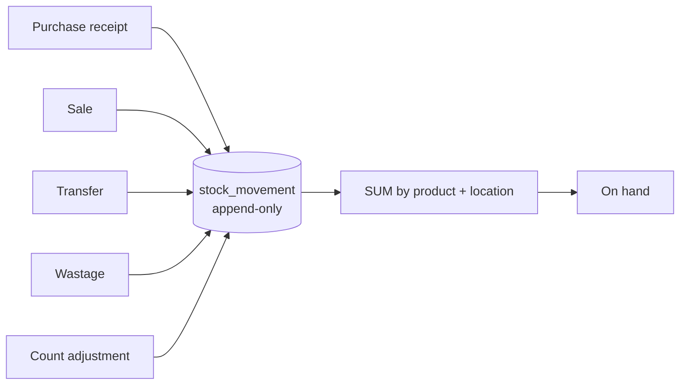

# Architecture

## Layout

```
apps/backend      Express + TypeScript + Prisma + PostgreSQL
apps/frontend     React
packages/contracts  Zod schemas and DTOs, organised by domain
```

pnpm workspaces. 29 Prisma migrations.

## Module shape

Domain-owned, not layer-owned. Each module keeps everything for its domain
together:

```
api/product/
  productRouter.ts       route definitions
  productController.ts   HTTP in, HTTP out
  productService.ts      business rules
  productRepository.ts   the only place touching the database
  productSchemas.ts      Zod validation
  productOpenApi.ts      generated API documentation
  __tests__/
```

Repeated across roughly thirty modules. The value is entirely in the repository
being the sole database boundary — that is what makes tenancy and soft-delete
enforceable in one place per domain rather than at every call site. If a service
reaches past its repository the benefit disappears silently, so the layering is a
review rule rather than a suggestion.

Keeping the OpenAPI definition next to the router matters more than it looks. API
documentation in a separate tree drifts within weeks; in the same directory as
the route it describes, a stale definition is visible in the same diff.

## Stock: ledger and derivation

Stock on hand is not a column. It is an aggregate over the stock-movement ledger:



Every stock change is an inserted movement. Nothing updates a quantity in place,
so there is no state that can silently diverge from its history, and any past
balance is reconstructible by replaying to a point in time.

Reads are aggregate queries, batched per page rather than per row —
`getOnHandByProductIds` resolves a whole product list in one pass over the ledger,
in raw parameterised SQL where Prisma's query builder is the wrong shape for the
aggregation.

**This does not scale indefinitely and is a driver of the rewrite.** Aggregating
a growing ledger on every read gets worse with age, and it gets worse fastest for
the busiest customer. The standard resolution is a maintained balance projection
that reads hit, with the ledger as the reconciliation authority behind it — the
ledger stays truth, but you stop recomputing from it on every request.

## Tenancy

Shared schema, `companyId` on every tenant-owned row, enforced through middleware
and composed repository predicates. See [multi-tenancy.md](multi-tenancy.md),
including the four known weaknesses.

## Contracts

`packages/contracts` holds Zod schemas by domain — asset, category, common,
customer, dashboard, file-attachment, invoice, maintenance-plan, notification and
the rest. The backend validates against them at runtime; the frontend imports the
inferred types. One definition, so a contract change fails the build rather than
surfacing at runtime.
